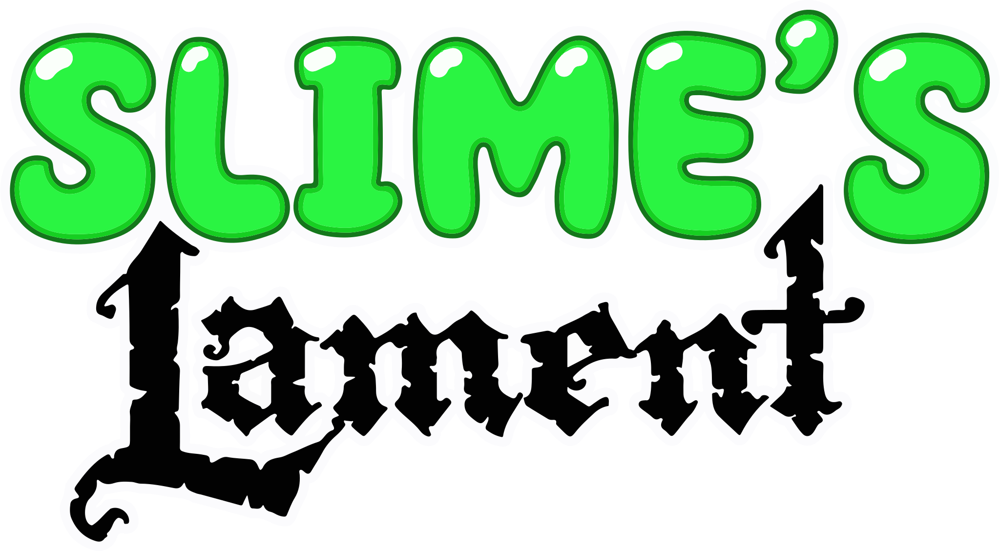

  
  
  </a>
  
  
  
  

## Welcome to the official game repo of Slime's Lament.

This is where all the files for the game is hosted, although there will be no build instructions.

## Todo

- [x] : Basic Movement and Physics.
- [x] : Basic Collision with the world. 
- [x] : Basic Enemy AI
- [ ] : GUI
- [ ] : Pause Menu
- [ ] : Attack
- [ ] : Animations

